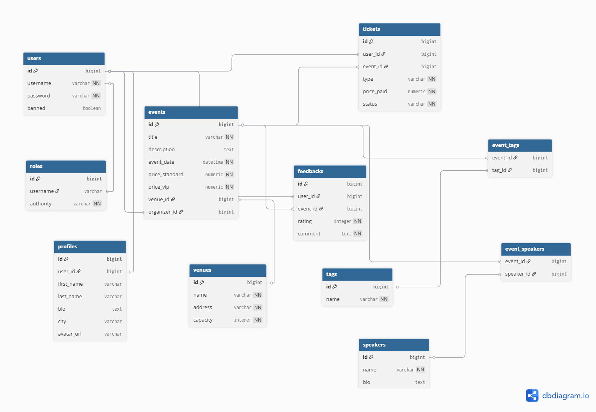
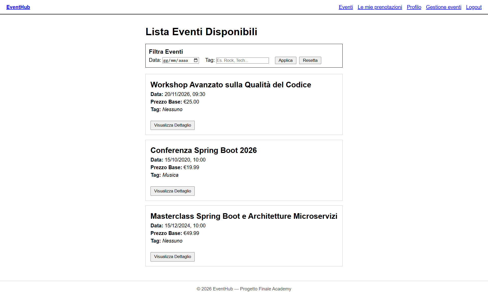
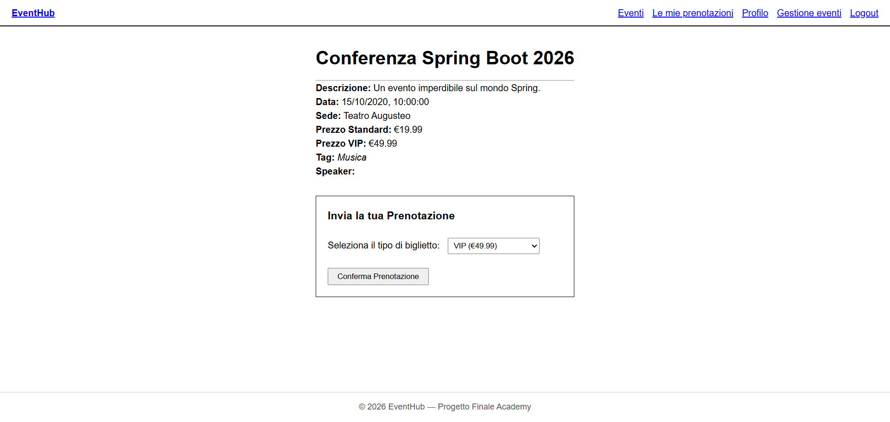
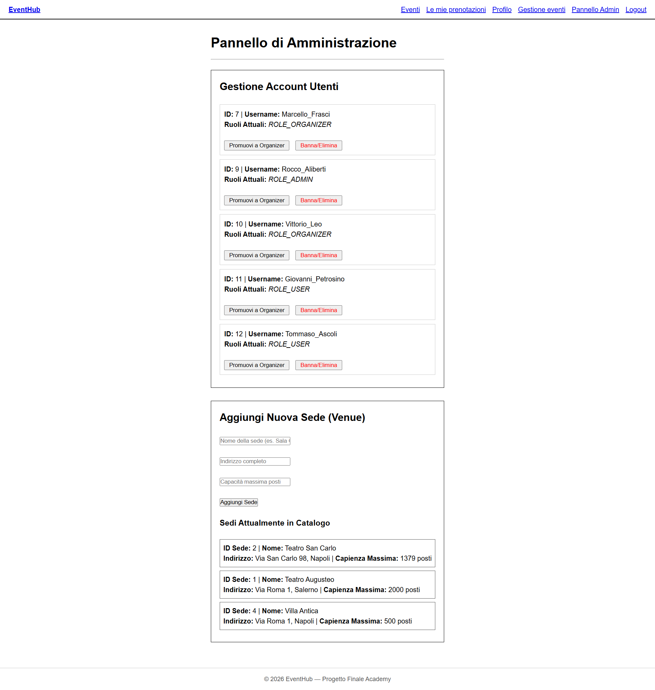
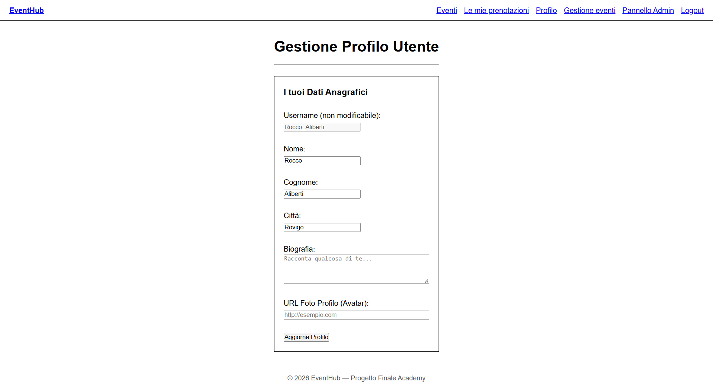

# EventHub — Progetto Finale Academy 2026

EventHub è l'applicazione creata per la fine del percorso in Academy. Serve a gestire e prenotare eventi come workshop o corsi, permettendo agli organizzatori di pubblicare le schede e agli utenti di prenotare i biglietti e lasciare recensioni.

Il progetto unisce in una sola applicazione la gestione di dati relazionali complessi, autenticazione e ruoli (RBAC), esposizione di API REST, validazione dei dati (Bean Validation), gestione globale delle eccezioni e un frontend di consumo interamente sviluppato in HTML5 statico e JavaScript Vanilla.

---

## 1. Descrizione delle Funzionalità e Ruoli

La piattaforma si basa su tre ruoli con permessi crescenti, governati da precise regole di business:

*   **USER (Utente Registrato):** Può gestire e aggiornare i propri dettagli personali (nome, cognome, biografia, città, URL avatar), sfogliare il catalogo degli eventi pubblici (con filtri per data e tag), prenotare un biglietto (Standard o VIP), consultare le proprie prenotazioni (e cancellarle prima dell'inizio) e lasciare un feedback.
*   **ORGANIZER (Organizzatore):** Eredita le funzioni di USER. Può creare nuovi eventi associandoli alle sedi e ai relatori in catalogo, modificare o cancellare i propri eventi, monitorare la lista dei partecipanti e vedere la media dei feedback ricevuti.
*   **ADMIN (Amministratore):** Ha il controllo totale della piattaforma. Gestisce gli utenti (promozione a ORGANIZER, revoca o eliminazione fisica), modera e cancella i feedback inappropriati e controlla i cataloghi condivisi delle sedi (Venues), dei relatori (Speakers) e delle categorie (Tags). Inoltre, può modificare o eliminare qualsiasi evento.

---

## 2. Regole di Business (Vincoli Funzionali)

Ogni regola è stata rigorosamente rispettata e implementata nella logica transazionale del Service Layer:

1. **Capienza fisica:** Ogni evento ha una capienza massima ereditata dalla sede. Non si possono accettare prenotazioni oltre la capienza.
2. **No doppia prenotazione:** Lo stesso utente non può avere due biglietti attivi per lo stesso evento.
3. **No prenotazioni nel passato:** Non si possono creare prenotazioni per eventi la cui data di inizio è già trascorsa.
4. **Cancellazione consentita solo prima dell'evento:** Dopo l'inizio, il biglietto resta come "partecipazione" e non può essere annullato.
5. **Feedback solo a posteriori:** Si può lasciare un feedback solo se: (a) l'evento si è concluso AND (b) l'utente aveva un biglietto valido (in stato `ACTIVE`).
6. **Un solo feedback per evento:** Lo stesso utente non può lasciare più feedback sullo stesso evento.
7. **Solo il creatore o l'admin** può modificare/cancellare un evento.
8. **Prezzi:** Il biglietto VIP deve costare più dello standard; entrambi i prezzi sono configurabili e validati per ciascun evento.
9. **Eliminazione Utente:** L'amministratore può rimuovere permanentemente un account. La cancellazione elimina l'anagrafica e disattiva/rimuove i relativi biglietti, impedendo futuri accessi tramite Basic Auth.

---

## 3. Schema del Database (Diagramma ER)

Ecco come ho strutturato le tabelle e le relazioni per il database del progetto (le relazioni includono mappature `@OneToOne` bidirezionali, `@OneToMany` e `@ManyToMany` con `Ticket` come *join entity* contenente campi extra):



---

## 4. Prerequisiti e Setup del Progetto

Prima di avviare il progetto, assicurati di avere sul computer:
*   Java 17
*   Maven (per i comandi locali)
*   Docker Desktop attivo

### Come avviare l'Infrastruttura con Docker
Ho configurato Postgres, Adminer e l'applicazione Spring Boot dentro un file `docker-compose.yml` basato su un `Dockerfile` multistadio (Stage 1: compilazione con Maven; Stage 2: esecuzione leggera con Alpine JRE).

Per accendere l'intero ecosistema a inizio giornata, apri il terminale nella cartella del progetto e lancia:
```bash
docker compose up -d --build
```
*Nota: Il container dell'applicazione backend (`spring-app`) partirà automaticamente solo dopo che il database PostgreSQL avrà superato con successo l'healthcheck di prontezza.*

Quando hai finito e vuoi spegnere tutto liberando la RAM, usa invece:
```bash
docker compose down
```

### Dati di Rete e Connessione:
*   **PostgreSQL:** gira internamente alla rete Docker e si espone su `localhost:5432` (Nome DB: `eventhub`, User: `eventhub_admin`, Password: `password123`). I dati sono persistiti sul volume locale `postgres_data`.
*   **Adminer (Interfaccia web):** raggiungibile nel browser su `http://localhost:8080`. Per accedere, seleziona il driver *PostgreSQL* e inserisci `postgres-db` nel campo *Server*.
*   **EventHub Backend & Frontend:** l'applicazione risponde all'indirizzo `http://localhost:8081`. Il frontend statico (HTML5/CSS3/JS Vanilla) viene servito direttamente alla radice (es. `http://localhost:8081/index.html`).

---

## 5. Comandi Principali per lo Sviluppo Locale

Se preferisci avviare o testare il backend localmente fuori da Docker (mantenendo attivo solo il container del database):

*   **Avviare solo il database:** `docker compose up -d postgres-db`
*   **Eseguire i test JUnit di Service Layer (`EventService`, `TicketService`):**
    ```bash
    mvn test
    ```
*   **Compilare ed avviare l'applicazione Spring Boot localmente:**
    ```bash
    mvn spring-boot:run
    ```

---

## 6. Credenziali Demo per il Test dei Flussi

All'avvio della piattaforma, puoi utilizzare i seguenti utenti preconfigurati nel database per testare la corretta risposta dinamica della navbar e delle autorizzazioni HTTP Basic basate sui ruoli (RBAC):


| Ruolo | Username | Password | Funzionalità Principale da Testare |
| :--- | :--- | :--- | :--- |
| **ADMIN** | `Rocco_Aliberti` | `PasswordSicura789` | Gestione cataloghi sedi/relatori, eliminazione e promozione utenti su `/admin.html`. |
| **ORGANIZER** | `Vittorio_Leo` | `PasswordSicura012` | Creazione eventi, controllo vincolo prezzi e monitoraggio partecipanti su `/organizer-events.html`. |
| **USER** | `Tommaso_Ascoli` | `PasswordSicura543` | Ricerca eventi, acquisto ticket, gestione profilo su `/profile.html` e feedback su `/my-bookings.html`. |

---

## 7. Documentazione delle API (Swagger & Postman)

A backend avviato, la documentazione interattiva generata automaticamente tramite `springdoc-openapi` è raggiungibile al seguente link:
*   **Swagger UI:** `http://localhost:8081/swagger-ui.html`

La Postman Collection completa, utile a verificare le risposte JSON formattate dal global exception handler (errori 400, 403, 404, 409), è stata esportata all'interno del progetto nella cartella:
*   `/docs/postman/`

---

## 8. Schermate dell'Applicazione (Screenshot)

### 1. Catalogo e Filtri Eventi pubblici (`events.html`)


### 2. Dettaglio Evento e Prenotazione (`event-detail.html`)


### 3. Pannello di Controllo Amministratore (`admin.html`)


### 4. Area Personale Gestione Profilo (`profile.html`)

